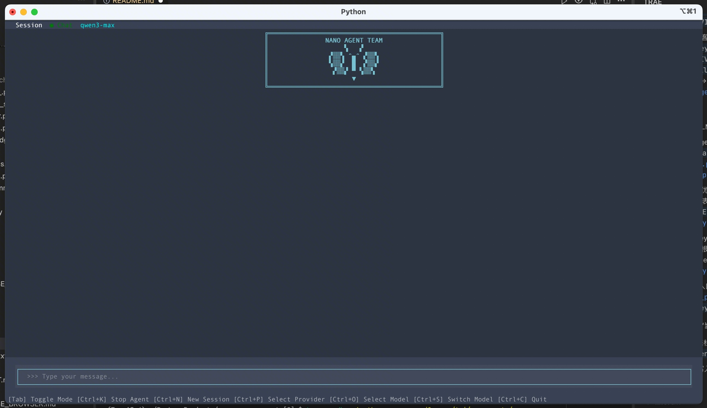

# Nano Agent Team

<div align="center">

**A flexible, standardized, file-system-based blackboard model multi-agent collaboration framework**

English (This page) | [中文文档](README_CN.md)

[](https://www.python.org/downloads/)
[](https://opensource.org/licenses/MIT)

</div>

---

## 📖 Table of Contents

- [Overview](#-overview)
- [Key Features](#-key-features)
- [System Architecture](#-system-architecture)
- [Quick Start](#-quick-start)
- [TUI Guide](#️-tui-guide)
- [CLI Guide](#-cli-guide)
- [Project Structure](#-project-structure)
- [Blackboard Mechanism](#-blackboard-mechanism)
- [Tooling](#-tooling)
- [Advanced Usage](#-advanced-usage)
- [FAQ](#-faq)
- [Contributing](#-contributing)

---

## 💡 Overview

**Nano Agent Team** is an experimental multi-agent collaboration framework based on the **Blackboard Model** for distributed handling of complex tasks. It uses the file system as a shared data space, enabling multiple agents to collaborate autonomously, plan dynamically, and communicate in real time.

### Design Principles

- **Protocol as Data**: use self-describing Markdown files as communication protocols instead of hard-coded APIs
- **Files as Database**: purely file-system based, no extra database required
- **Dynamic Self-Organization**: the Watchdog agent analyzes tasks, plans the blackboard structure, and spawns/coordinates Worker agents
- **Human-in-the-Loop**: monitor and intervene in agent execution through the TUI

### Use Cases

- 🎯 Complex software projects (requirements → architecture → coding → testing)
- 📊 Data analysis and report generation (collection → cleaning → analysis → visualization → report)
- 🔬 Research assistance (literature search → information extraction → experiment design)
- 🤝 Multi-agent collaboration for discussion and decision-making (brainstorming, debating, reviewing)

---

## 🌟 Key Features

### 1. 📋 Blackboard Collaboration Model

**Core Concept**: **Global State Consistency** + **Decoupling of Coordination and Execution**

The biggest challenge in multi-agent systems is how to maintain a unified **Shared Mental Model** among decentralized agents, enabling them to perceive the global state and collaborate effectively. This framework solves this problem through a layered architecture.

#### Layered Architecture

**🎯 The Collaboration Plane / Index**: `global_indices/`

- **Role**: The system's **control center** and **synchronization primitive**.
- **Function**: Maintains the project's **global state** (e.g., task progress, dependencies, architectural decisions). It serves as the "communal memory" for all agents, ensuring a consistent understanding of "what is currently being done" and "what to do next" at any given moment.
- **Mechanism**: Based on **CAS (Compare-And-Swap)** metadata management, providing atomic state changes to resolve multi-agent concurrency race conditions.

**📦 The Resource Plane / Data**: `resources/`

- **Role**: The system's data warehouse and artifact center.
- **Function**: Stores specific **execution artifacts** (code, documents, data). These are the "results" of agent collaboration, not the "process".
- **Mechanism**: Exists as a standard file system, referenced and version-managed through the collaboration layer's indices.

```
┌────────────────────────────────────────────────────────┐
│                   .blackboard/                         │
│ ┌────────────────────────────────────────────────────┐ │
│ │  global_indices/  [Collaboration Plane]            │ │
│ │  ├── central_plan.md  (Task Scheduler & Deps)      │ │
│ │  ├── notification.md  (Collab History & Milestones)│ │
│ │  └── ...                                           │ │
│ ├────────────────────────────────────────────────────┤ │
│ │  resources/       [Resource Plane]                 │ │
│ │  ├── code/            (Generated Source Code)      │ │
│ │  ├── docs/            (Ref Docs & Specs)           │ │
│ │  └── assets/          (Images/Data/Others)         │ │
│ └────────────────────────────────────────────────────┘ │
└────────────────────────────────────────────────────────┘
```

#### Key Mechanisms

**✅ Intent Alignment**
- Explicitly externalize abstract collaboration intents through structured Index Files and YAML metadata.
- Enables agents to automatically understand collaboration protocols without hard-coded APIs.

**🔒 State Consensus**
- Uses lightweight optimistic locking to achieve distributed strong consistency of state without introducing centralized scheduling bottlenecks.
- Supports multi-agent concurrent read/write with automatic conflict resolution.

### 2. 🤖 Watchdog Architect Mode

**Core Concept**: **Planning vs Execution Separation** + **Role-Based Orchestration**

The Watchdog acts like the project's **Product Manager or Architect**; its core responsibility is not "management" but "definition".

#### Design Principles

**🎯 Non-Interference**

- **Define Roles, Not People**: Define what Role a Task needs; Workers claim them autonomously.
- **Focus on Results, Not Process**: Do not micromanage specific tool calls; intervene only when tasks time out or deviate from the plan.
- **Empowerment over Control**: Provide agents with clear goals and context, trusting their autonomous decision-making capabilities.

#### Multi-Mode Compatibility

Thanks to the design principles above, the framework can flexibly handle different types of multi-agent collaboration tasks, such as:

**🏗️ Construction Mode / Project**

- **Characteristics**: Clear deliverables (e.g., software, reports).
- **Responsibility**: Decompose the goal into a **Directed Acyclic Graph (DAG)** of dependencies. Tasks advance linearly or in parallel, eventually converging into a result.
- **Example**: Software development (Requirements → Design → Dev → Test).

**🎮 Simulation Mode / Process**

- **Characteristics**: Focus on emerging phenomena of the process itself; deliverables are often process logs or side products.
- **Responsibility**: Define **Environment Rules** and **Agent Roles**, allowing them to operate in parallel and independently. Tasks may not have strong dependencies but are triggered based on environmental state.
- **Example**: Village simulation (each villager lives by their Role, updating their status on the blackboard without waiting for others).

### 3. 🎨 TUI Console

Terminal User Interface built on [Textual](https://github.com/Textualize/textual):

- **🔄 Real-time Monitoring**: View agent thinking steps, tool calls, and execution logs.
- **📊 Mission Board**: Visualize Mission Plan execution progress and dependencies.
- **🎛️ Multi-Model Support**: Read and switch between multiple provider models from `llm_config.json`.
- **⚡ Runtime Intervention**: Send instructions or feedback to any agent at any time during execution.
- **🎯 Dual-Mode Switching**: Support for Single-Agent (Chat) and Multi-Agent (Swarm) modes.

### 4. 🔌 Skills & Subagent Plugin Systems (Experimental)

Support extending agent capabilities via the `.skills/` directory. Sub-skills need to be defined in subdirectories; see [Agent Skills Documentation](https://platform.claude.com/docs/en/agents-and-tools/agent-skills/overview) for details.

Support extending agent capabilities via the `.subagents/` directory. See [Sub-agents Documentation](https://code.claude.com/docs/en/sub-agents) for details.

### 5. 📡 Multi-Model Support

A unified interface supports multiple LLM providers:

- **OpenAI**
- **DeepSeek**
- **Qwen**
- **Step**
- **Moonshot**
- **MiniMax**
- **OpenRouter**
- **XAI**
- **Together**

> Subject to `backend/llm_config.json`; can be extended.

---

## 🏗️ System Architecture

### Overall Architecture Diagram

> System architecture diagram

```
┌─────────────────────────────────────────────────────────────┐
│                          User Layer                          │
│  ┌──────────────────┐         ┌──────────────────┐          │
│  │   TUI Console     │         │   CLI Terminal   │          │
│  │  (tui.py)         │         │  (main.py)       │          │
│  └────────┬─────────┘         └────────┬─────────┘          │
└───────────┼────────────────────────────┼────────────────────┘
            │                            │
┌───────────┼────────────────────────────┼────────────────────┐
│           │       Coordination Layer   │                    │
│  ┌────────▼────────────────────────────▼─────────┐          │
│  │        Watchdog / Architect                   │          │
│  │  - Task analysis & planning                   │          │
│  │  - Blackboard structure design                │          │
│  │  - Worker agent spawning                      │          │
│  │  - Progress monitoring & exception handling   │          │
│  └─────────────────┬─────────────────────────────┘          │
└────────────────────┼────────────────────────────────────────┘
                     │ spawn
┌────────────────────┼────────────────────────────────────────┐
│                    │            Execution Layer             │
│  ┌─────────────────▼────────────────────────────┐           │
│  │         Worker Agents Pool                   │           │
│  │  ┌──────────┐ ┌──────────┐ ┌──────────┐      │           │
│  │  │Programmer│ │ Reviewer │ │  Tester  │ ...  │           │
│  │  └──────────┘ └──────────┘ └──────────┘      │           │
│  └────────┬──────────┬──────────┬───────────────┘           │
│           │          │          │                           │
│  ┌────────▼──────────▼──────────▼───────────────┐           │
│  │            Tool Registry                     │           │
│  │  file, blackboard, bash, web_search, ...     │           │
│  └──────────────────────────────────────────────┘           │
└──────────────────────┬──────────────────────────────────────┘
                       │ read/write
┌──────────────────────▼──────────────────────────────────────┐
│                   Data Layer (.blackboard/)                  │
│  ┌─────────────────────────────────────────────────────┐    │
│  │  global_indices/   # global indexes (tasks, timeline)│    │
│  │  resources/        # resource files (code, docs, data)│   │
│  │  mailboxes/        # agent mailboxes                 │    │
│  │  logs/             # execution logs                  │    │
│  └─────────────────────────────────────────────────────┘    │
└─────────────────────────────────────────────────────────────┘
```

### Core Components

#### 1. SwarmAgent

The core agent class that encapsulates LLM calls, tool execution, and middleware management.

**Main responsibilities**:
- Manage conversation history and context
- Dispatch tool execution
- Apply middleware policies (budgeting, request monitoring)
- Generate system prompts

**Related files**:
- `src/core/agent_wrapper.py`
- `src/core/middlewares.py`
- `src/core/runtime.py`
- `src/core/prompt_builder.py`
- `backend/llm/engine.py`

#### 2. Blackboard System

**Main responsibilities**:
The blackboard tool provides standardized read/write interfaces (Swarm mode):

- `list_indices()` to list index files
- `read_index(filename)` to read an index file
- `append_to_index(filename, content)` to append content
- `update_index(filename, content, expected_checksum)` with checksum validation
- `update_task(...)` to update task status
- `create_index(filename, content)` to create index files

**Related files**:
- `src/tools/blackboard_tool.py`
- `src/core/protocol.py`
- `src/utils/file_lock.py`
- `src/core/schema.py`

#### 3. LLM Agent Engine

**Main responsibilities**:
Execute the core ReAct loop and tool calls:

- Streaming generation and function calls
- Sub-agent collaboration and skill loading
- Middleware chain (budgeting, loop detection, error recovery)

**Related files**:
- `backend/llm/engine.py`
- `backend/llm/tool_registry.py`
- `backend/llm/skill_registry.py`
- `backend/llm/decorators.py`
- `backend/llm/middleware.py`

#### 4. Prompt Builder & Protocol

Dynamically build system prompts and parse blackboard protocols:

- Generate system prompts from global indices
- Parse YAML Frontmatter metadata and usage policies

**Related files**:
- `src/core/prompt_builder.py`
- `src/core/protocol.py`
- `src/core/schema.py`

#### 5. Runtime & Lifecycle

Runtime and lifecycle management:

- Registry state maintenance and cleanup
- Event logs and global notification broadcast

**Related files**:
- `src/core/runtime.py`
- `src/core/middlewares.py`
- `src/tools/status_tool.py`

---

## 🚀 Quick Start

### Requirements

- **Python**: 3.11 or higher
- **OS**: macOS, Linux
- **API Key**: at least one LLM provider API key

### Installation

1. **Clone the repository**

```bash
git clone <your-repo-url>
cd open_swarm_agent
```

2. **Create a virtual environment (recommended)**

```bash
python -m venv venv
source venv/bin/activate
```

3. **Install dependencies**

```bash
pip install -r requirements.txt
```

4. **Install browsers (optional, for browser_use)**

If you need the `browser_use` tool for browser automation, install Playwright browsers:

```bash
# Install Chromium (recommended)
playwright install chromium

# Or install all browsers (Chromium, Firefox, WebKit)
playwright install
```

**Notes**:
- If browsers are not installed, the system will skip loading `browser_use`, without affecting other features
- Browsers are installed in the Playwright cache directory
- browser_use requires the LLM provider to support `response_format` = `json_object`; see the [browser_use docs](https://github.com/browser-use/browser-use)

**Verify installation**:
```bash
# Check Playwright version
playwright --version

# Verify browsers
python -c "from playwright.sync_api import sync_playwright; p = sync_playwright().start(); print('Browser installed:', p.chromium.executable_path); p.stop()"
```

5. **Initialize configuration**

On first run, the config directory is created automatically:

```bash
~/.nano_agent_team/
├── auth.json        # API Keys
└── tui_state.json    # TUI state
```

### How to Run

#### Option 1: TUI Mode (recommended)

```bash
python tui.py
```

After launching:
1. Press `Ctrl+P` to open the provider panel
2. Choose your LLM provider (e.g., qwen)
3. Enter your API Key
4. Press `Esc` to return, then `Ctrl+O` to select a model
5. Enter a task description and press `Enter` to start; switch between `Chat` / `Swarm`
- `chat` mode: single-agent conversation
- `swarm` mode: multi-agent collaboration

#### Option 2: CLI Mode

```bash
# Execute a task directly
python main.py "Build a snake game"

# Interactive mode (prompts for input)
python main.py
```

#### Option 3: Worker Mode (advanced)

Manually start a Worker agent:

```bash
python src/cli.py \
  --role "Python Developer Expert" \
  --name "Coder" \
  --blackboard ".blackboard" \
  --goal "Implement quicksort" \
  --model "qwen/qwen3-max"
```

### Verify Installation

Run test commands to check the environment:

```bash
# Test TUI launch
python tui.py

# Test CLI mode
python main.py "Hello, introduce yourself"
```

---

## 🖥️ TUI Guide

### Interface Overview

The Nano Agent Team TUI has two main screens:
```
┌────────────────────────────────────────────────────────┐
│   Session Screen        →       Monitor Screen         │
│   (main chat screen)             (Swarm monitor)        │
│   Chat / Swarm toggle            Multi-agent monitoring │
└────────────────────────────────────────────────────────┘
```

TUI screenshot



TUI demo video

https://github.com/user-attachments/assets/1e6cf2fd-8832-4fe6-b6a5-fd7787075686

### 1. Session Screen

**Purpose**: start tasks, interact, switch Chat/Swarm modes

**UI elements**:
- Input box: enter task descriptions or commands
- Mode toggle: `Chat` / `Swarm`
- Model indicator: current selected model

**Shortcuts**:

| Shortcut | Action | Description |
|----------|--------|-------------|
| `Enter` | Start session | Send task description and enter Session |
| `Tab` | Toggle mode | Switch between Chat and Swarm |
| `Ctrl+P` | Provider config | Open provider connection panel |
| `Ctrl+O` | Select model | Open model selection dialog |
| `Ctrl+S` | Switch model | Quick switch between recent models |
| `Ctrl+C` | Exit | Close the application |


### 2. Monitor Screen

**Purpose**: monitor multi-agent execution in Swarm mode

**Layout**:
```
┌──────────────────────────────────────────────────────────────┐
│  Monitor - Swarm Execution                                   │
├─────────┬────────────────────────────────┬───────────────────┤
│ Agents  │  Execution Timeline            │  Mission Plan     │
│         │                                │                   │
│ ● Alice │  [12:00:01] Thinking...        │  ✅ Task 1       │
│   Bob   │  [12:00:03] Tool: read_file    │  🔄 Task 2 (Bob) │
│         │  > path: src/main.py           │  ⏳ Task 3       │
├─────────┴────────────────────────────────┴───────────────────┤
│  > Send a message to Alice...                                 │
└──────────────────────────────────────────────────────────────┘
```

**Shortcuts**:

| Shortcut | Action | Description |
|----------|--------|-------------|
| `↑` `↓` | Select agent | Switch in the left list |
| `Enter` | Send intervention | Send instructions to selected agent |
| `Esc` | Back to session | Exit monitor to Session |
| `Ctrl+C` | Exit | Close the application |

**Real-time status**:
- **Thinking**: shows "🤔 Thinking..."
- **Tool call**: shows "🔧 Calling tool: tool_name"
- **Waiting**: shows progress animation

**Modes**:
- **Chat mode**: single-agent chat, good for simple queries
- **Swarm mode**: launches Watchdog to coordinate multi-agent tasks

### 3. Provider Configuration (Ctrl+P)

**Example UI**:
```
┌──────────────────────────────────────┐
│  Connect to Providers                │
├──────────────────────────────────────┤
│  🟢 OpenAI          [Connected]       │
│  ⚪ Anthropic       [Disconnected]    │
│  ⚪ Google          [Disconnected]    │
├──────────────────────────────────────┤
│  Select a provider to configure API Key |
└──────────────────────────────────────┘
```

**Steps**:
1. Use `↑` `↓` to select a provider
2. Press `Enter` to open the API key input dialog
3. Paste your API key and confirm
4. The status light turns 🟢 for a successful connection
5. Press `Esc` to close the panel

**Supported providers** (default config):
- Step, Qwen, DeepSeek, Moonshot, MiniMax
- OpenAI, OpenRouter

> See `backend/llm_config.json` for the actual list and customization.

### 4. Model Selection (Ctrl+O)

**Example UI**:
```
┌──────────────────────────────────────┐
│  Select Model                        │
├──────────────────────────────────────┤
│     ● deepseek-chat                   │
│      deepseek-reasoner               │
├──────────────────────────────────────┤
│  ↑↓: Navigate  Enter: Select  Esc: Cancel |
└──────────────────────────────────────┘
```

**Usage notes**:
- Only models from connected providers are shown
- Use `↑` `↓` to navigate, `Enter` to select
- The current model is marked with `●`

---

## 💻 CLI Guide (for testing)

### main.py - Watchdog launcher

**Basic usage**:

```bash
python main.py [OPTIONS] [QUERY]
```

**Parameters**:

| Parameter | Type | Default | Description |
|----------|------|---------|-------------|
| `QUERY` | string | - | task description (optional, interactive if omitted) |
| `--role` | string | `Architect` | role of the primary agent |
| `--name` | string | `Watchdog` | name of the primary agent |
| `--keep-history` | flag | False | keep previous blackboard data |
| `--model` | string | from config | specify model (e.g., `openai/gpt-5-mini`) |
| `--keys` | string | `keys.json` | API keys config file path |

**Examples**:

```bash
# 1. Interactive mode
python main.py

# 2. Execute a task directly
python main.py "Build a command-line calculator"

# 3. Specify a model
python main.py --model "qwen/qwen3-max" "Analyze this code's performance"

# 4. Custom Watchdog role
python main.py --role "Senior Software Architect" --name "Architect" "Design a microservices architecture"
```

### src/cli.py - Worker launcher

**Basic usage**:

```bash
python src/cli.py --role ROLE --name NAME [OPTIONS]
```

---

## 📂 Project Structure

### Project Root

```
open_swarm_agent/
├── tui.py                   # TUI main entry
├── main.py                  # CLI Watchdog launcher
├── requirements.txt         # Python dependencies
├── LICENSE                  # MIT license
├── README.md                # This document
├── README_CN.md             # Chinese document
├── dev_log.md               # Development log
│
├── src/                     # Core source code
│   ├── cli.py               # Worker CLI launcher
│   ├── core/                # Core modules
│   ├── prompts/             # System prompts
│   ├── tools/               # Agent tools
│   ├── tui/                 # TUI UI code
│   └── utils/               # Utilities
│
├── backend/                 # Backend infrastructure
│   ├── infra/               # Config & environment
│   ├── llm/                 # LLM engine and registry
│   ├── tools/               # General tool implementations
│   └── utils/               # Backend utilities
│
├── .blackboard/session_**   # [runtime] blackboard data
│   ├── global_indices/      # global indices
│   ├── resources/           # resource files
│   ├── mailboxes/           # agent mailboxes
│   └── logs/                # execution logs
│
├── .skills/                 # [optional] skills plugins
│   └── arxiv-search/        # example: academic search skill
│       ├── SKILL.md
│       ├── arxiv_search.py
│       └── requirements.txt
│
├── blackboard_templates/    # blackboard templates
│   └── central_plan.md      # task plan template
│
└── logs/                    # [runtime] session archive
    └── app.log
    └── tui.log
```

### src/ - Core Source Code

```
src/
├── cli.py                      # Worker agent CLI launcher
│
├── core/                       # Core logic
│   ├── __init__.py
│   ├── agent_wrapper.py        # SwarmAgent core class
│   ├── middlewares.py          # Middleware system
│   ├── prompt_builder.py       # Prompt builder
│   ├── protocol.py             # Blackboard protocol parser
│   ├── schema.py               # Data models
│   ├── runtime.py              # Runtime management
│   └── ipc/                    # Inter-process communication
│       └── request_manager.py  # Request manager
│
├── prompts/                    # System prompts
│   └── architect.md            # Watchdog architect prompt
│
├── tools/                      # Agent-specific tools
│   ├── blackboard_tool.py      # Blackboard read/write tool
│   ├── spawn_tool.py           # Agent spawning tool
│   ├── wait_tool.py            # Wait tool
│   ├── status_tool.py          # Status update tool
│   └── finish_tool.py          # Task completion tool
│
├── tui/                        # TUI UI code
│   ├── app.py                  # TUI main application class
│   ├── agent_bridge.py         # Agent bridge
│   ├── state.py                # Global state management
│   ├── themes.py               # Theme configuration
│   ├── commands.py             # Command handling
│   ├── slash_commands.py       # Slash commands
│   ├── constants.py            # Constants
│   ├── components/             # UI components
│   │   ├── message.py          # Message component
│   │   └── plan_widget.py      # Plan board component
│   ├── dialogs/                # Dialogs
│   │   ├── provider.py         # Provider config
│   │   ├── model.py            # Model selection
│   │   ├── api_key.py          # API key input
│   │   └── command.py          # Command panel
│   └── screens/                # Screens
│       ├── session.py          # Session screen
│       └── monitor.py          # Monitor screen
│
└── utils/                      # Utilities
    └── file_lock.py            # File lock (prevent conflicts)
```

### backend/ - Backend Infrastructure

```
backend/
├── infra/                      # Infrastructure
│   ├── config.py               # Global config class
│   ├── auth.py                 # Authentication manager
│   ├── environment.py          # Environment abstraction
│   ├── provider_registry.py    # LLM provider registry
│   └── envs/                   # Execution environments
│       ├── local.py            # Local environment
│       ├── docker_env.py       # Docker environment
│       └── e2b_env.py          # E2B cloud environment
│
├── llm/                        # LLM engine
│   ├── engine.py               # AgentEngine core
│   ├── providers.py            # Multi-model adapters
│   ├── middleware.py           # LLM middleware
│   ├── tool_registry.py        # Tool registry
│   ├── skill_registry.py       # Skill registry
│   ├── events.py               # Event definitions
│   ├── types.py                # Type definitions
│   └── decorators.py           # Decorators
│
├── tools/                      # General tool implementations
│   ├── base.py                 # Tool base class
│   ├── read_file.py            # Read files
│   ├── write_file.py           # Write files
│   ├── edit_file.py            # Edit files
│   ├── bash.py                 # Execute bash commands
│   ├── web_search.py           # Web search
│   ├── web_reader.py           # Web reader
│   ├── arxiv_search.py         # Academic search
│   ├── browser_use.py          # Browser automation
│   ├── grep.py                 # Content search
│   ├── glob.py                 # File matching
│   ├── subagent.py             # Sub-agent tool
│   └── activate_skill.py       # Skill activation
│
└── utils/                      # Backend utilities
    ├── logger.py               # Logging
    ├── audit_guard.py          # Audit guard
    └── langfuse_manager.py     # Langfuse integration
```

### .blackboard/ - Blackboard Data (runtime)

```
.blackboard/session_<timestamp>
├── global_indices/
├── resources/
├── mailboxes/
└── logs/
```

### .skills/ - Skills Plugin Directory

```
.skills/                        # [user-defined skills]
│
├── arxiv-search/               # example: academic paper search
│   ├── SKILL.md                # skill description & usage
│   ├── arxiv_search.py         # skill implementation
│   ├── requirements.txt        # dependencies
│   └── eval.md                 # evaluation criteria
│
└── custom-skill/               # user-defined skills
    ├── SKILL.md
    ├── custom_skill.py
    └── requirements.txt
```

### Configuration Directory

```
~/.nano_agent_team/            # user config directory
├── auth.json                   # API Keys
├── tui_state.json              # TUI state (recent model)
```

---

## 🗂️ Blackboard Mechanism

The blackboard is a shared state and artifact store for multi-agent collaboration, created at runtime under `.blackboard/`.

### Directory Overview (runtime)
- `global_indices/`: index files (with YAML Frontmatter)
- `resources/`: large files and artifacts (code, reports, data, etc.)
- `mailboxes/`: agent mailboxes (JSON lists)
- `logs/`: runtime logs

### blackboard_tool (Swarm mode)
Currently supported operations:
- `list_indices`
- `read_index` (`filename`)
- `append_to_index` (`filename`, `content`)
- `update_index` (`filename`, `content`, `expected_checksum`)
- `update_task` (`filename` optional, `task_id`, `updates`, `expected_checksum`)
- `create_index` (`filename`, `content`)
- `list_templates` / `read_template`
- `list_resources`

Example:
```python
agent.call_tool("blackboard_tool", {
    "operation": "read_index",
    "filename": "central_plan.md"
})

agent.call_tool("blackboard_tool", {
    "operation": "update_task",
    "task_id": "task_1",
    "updates": {"status": "IN_PROGRESS"}
})
```

### Concurrency Control
Use file locks for atomic read/write:
```python
from src.utils.file_lock import file_lock

with file_lock(".blackboard/global_indices/central_plan.md", "r+"):
    content = read_file("central_plan.md")
    updated = modify(content)
    write_file("central_plan.md", updated)
```

---

## 🚀 Advanced Usage

### 1. Custom Watchdog Prompt
Edit [architect.md](file:///Users/bytedance/PycharmProjects/open_swarm_agent/src/prompts/architect.md) to customize Swarm planning and constraint policies.

### 2. Multi-Model Mix
```bash
python main.py --model "qwen/qwen3" "Build a blog system"
```

```python
agent.call_tool("spawn_swarm_agent", {
    "name": "Coder",
    "role": "Python Developer",
    "model": "deepseek/deepseek-chat",
    "goal": "Implement user login"
})
```

### 3. Sub-agents and Skills
- Sub-agents: `.subagents/*.md` are registered as tools with the same name (e.g., `file_organizer`)
- Skills: `activate_skill` returns SOPs and constraints, follow the instructions
```

---

## ❓ FAQ

### Q1: How do I switch models?

**A**: Press `Ctrl+O` in the TUI, or use `--model` in CLI:

```bash
python main.py --model "qwen/qwen3" "Task description"
```

### Q2: What if an agent is unresponsive?

**A**: Possible causes and fixes:

1. **Token limit**: increase the `max_iterations` parameter
   ```bash
   python src/cli.py --max-iterations 100 ...
   ```

2. **Network issues**: check API connectivity and logs

3. **Deadlock**: check Monitor to see if an agent is waiting on others

### Q3: How do I clean history data?

**A**: Delete the blackboard directory:

```bash
rm -rf .blackboard
```

### Q4: Which LLM models are supported?

**A**: See `backend/llm_config.json`, default includes:

- OpenAI: gpt-5.2, gpt-5.1, gpt-5-mini, gpt-5-nano, gpt-5.2-codex
- DeepSeek: deepseek-chat, deepseek-reasoner
- Qwen: qwen3-max, qwen-plus, qwen-flash
- Step: step-3.5-flash
- Moonshot: kimi-k2.5, kimi-k2-turbo-preview
- MiniMax: MiniMax-M2.1
- OpenRouter

### Q5: How do I restrict agent file access?

**A**: Use the `allowed_write_paths` parameter in `LocalEnvironment`:

```python
env = LocalEnvironment(
    workspace_root="/project",
    allowed_write_paths=[".blackboard"]  # only allow blackboard writes
)
```

### Q6: Can I use this in production?

**A**: It is currently in development and recommended for:
- ✅ Prototyping
- ✅ Research and experiments
- ✅ Automation scripts

Not recommended for:
- ❌ Critical business systems
- ❌ Sensitive data
- ❌ Unattended production environments

### Q7: How do I contribute?

**A**: See [Contributing](#-contributing).

### Q8: How do agents communicate?

**A**: Mainly through two methods:

1. **Blackboard indices**: shared index files (e.g., `central_plan.md`)
2. **Mailbox system**: direct messages (`mailboxes/<agent_name>.json`)

### Q9: How do I debug agent behavior?

**A**:

1. **Use the Monitor screen**: view the thinking process in real time

2. **Check blackboard files**: manually inspect `.blackboard/` files

### Q11: What if browser_use does not work?

**A**: If you see errors like "Failed to establish CDP connection":

1. **Check Playwright installation**:
   ```bash
   playwright --version
   ```

2. **Install browsers**:
   ```bash
   playwright install chromium
   ```

3. **Verify installation**:
   ```bash
   python3 -c "from playwright.sync_api import sync_playwright; p = sync_playwright().start(); print(p.chromium.executable_path); p.stop()"
   ```
4. **Check LLM provider**:
     The LLM provider must support `response_format` as `json_object`. See the [browser_use docs](https://github.com/browser-use/browser-use)

5. **Note**:
   - The system automatically detects browser installation and skips `browser_use` if not installed
   - This does not affect other tools
- Logs show a warning: `[ToolRegistry] Playwright browser not installed. Run 'playwright install chromium' to enable browser_use tool.`

---

## 🤝 Contributing

We aim to explore the feasibility and practical value of autonomous multi-agent systems. Contributions of all kinds are welcome. Contact us by email or WeChat!

### Ways to Contribute

1. **Report Bugs**: submit detailed issues in the repository
2. **Feature Requests**: submit feature requests
3. **Code Contributions**: open pull requests
4. **Docs Improvements**: help improve docs and examples
5. **Skills Plugins**: share your custom skills

## 📄 License

This project is licensed under the [MIT License](LICENSE).

---

## 🙏 Acknowledgements

Thanks to the following projects:

- [opencode](https://github.com/anomalyco/opencode)
- [Textual](https://github.com/Textualize/textual)
- antigravity/cursor/...

---

## 📧 Contact

- **Email**: <zc3930155@gmail.com> <wzq142857@gmail.com> <2910937975@qq.com>

- **WeChat**:

---

If this project helps you, please give us a ⭐ Star!

Made with ❤️ by Nano Agent Team Community
